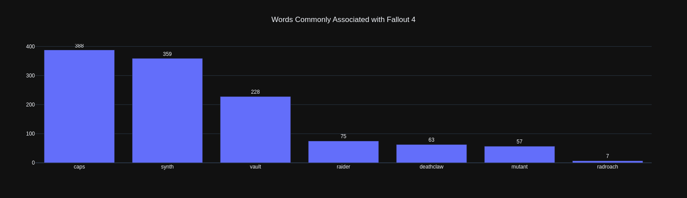
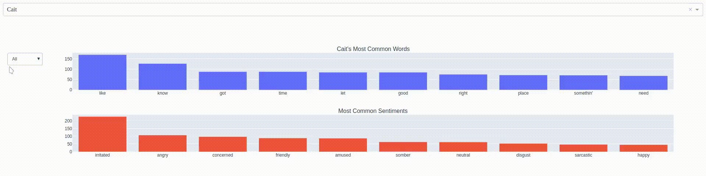

# Fallout 4: Most Common Words Shown in Plotly and Dash

This repository includes a Jupyter Notebook and Python script that investigates the most common words of the Fallout 4 universe. The notebook covers most of the code constituting the functions found in `generate_chart.py` and generates `.csv` files for all characters who have dialogue data available. The Python script, however, mainly serves as a Dash app in which the user may select a character via dropdown menu to plot the selected character's ten most common words and sentiments.

Below is a graph within the Jupyter Notebook displaying the count of a few words commonly associated with the Fallout universe.

A graph of the most common words in the Fallout 4 universe may be found inside the Jupyter Notebook. Check it out!

## How to Use

Clone the repository and install the necessary Python packages by running `pip install -r requirements.txt` in a virtual environment, then run `python generate_chart.py`. The Dash app will automatically open itself in the user's default browser.

